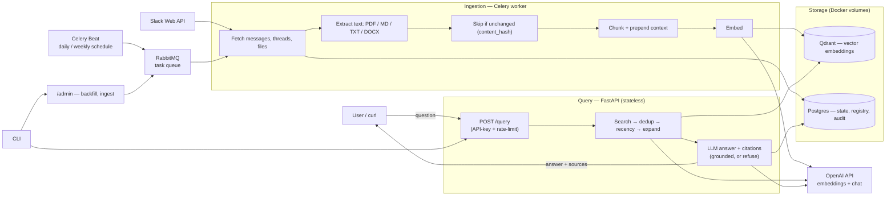

# LoopGuru — Features & Architecture

An internal, **query-based AI agent** that indexes the organization's Slack knowledge and
answers questions in plain language — grounded **strictly in internal data**, with source
citations. Current focus: **Slack** (built to extend to GitHub / Azure later).

## Architecture



## ✅ Built (Slack v1)

| Feature | What it does |
|---|---|
| **Slack ingestion** | Allowlisted channels — messages, thread replies, and file attachments |
| **File text extraction** | PDF, Markdown, TXT, DOCX, and **Slack Canvases** → clean text for indexing |
| **Image & diagram OCR (vision)** | Screenshots, diagrams, and scanned/text-less PDFs are transcribed via a vision model so their content becomes searchable |
| **Grounded RAG Q&A** | Semantic search + LLM answer using **only internal data** — refuses instead of hallucinating |
| **Source citations** | Every answer links back to the exact Slack message / file (permalinks) |
| **Hybrid retrieval (BM25 + vector)** | Keyword (BM25) fused with vector search via RRF — exact terms/acronyms (e.g. "YTM", "UAT") rank well, not only semantic matches |
| **Procedural / how-to** | "How do I set up X?" → full step-by-step guide reproduced from the doc |
| **Summaries & digests** | On-demand **thread summaries** + **channel digests**; scheduled daily/weekly digests (delivered via alert webhook; Slack-posting pending `chat:write`) |
| **Azure Boards ticket (action)** | Describe a problem → agent drafts a work item (title, acceptance criteria, **enriched with Slack references**) and files it on **Azure DevOps** with a confirm step |
| **Slack @mention bot** | `@loopguru <question>` in a channel → grounded + cited reply in-thread; also `@… summarize` (thread/channel) and `@… ticket <problem>` |
| **Ambient auto-answer** _(opt-in)_ | Listens to **un-mentioned** questions in allowlisted channels and jumps in **only when confident** (raised confidence bar) — replies in-thread with citations; otherwise stays silent. `@` it in that thread to continue the normal memory-based chat. Off by default (`ENABLE_PASSIVE_REPLY`). |
| **"Discussed before" detector** | Every answer also surfaces **older relevant threads** ("📌 Ye pehle bhi discuss hua tha: …") so you can jump to where a topic was talked about earlier — reuses the same semantic retrieval. |
| **Find the source/thread on demand** | `@loopguru was this discussed before? share it` or `…koi payable funds ka example/link hai kya?` → the bot returns the matching **Slack thread & file links** (a `find_discussions` tool), no answer text — just where it lives. |
| **Confidence badge** | Each answer ends with a **🟢/🟡/🟠 confidence · N sources** footer so readers know how much to trust it (derived from the top retrieval score). |
| **DM the bot** | Message `@loopguru` directly — in a DM every message is for the bot, no `@` needed. Same agentic brain (answers, summaries, tickets, reminders) but private. |
| **Reminders** | "kal 5 baje deployment check karna yaad dilana" → the bot schedules it and pings at that time, right where you asked. Remind someone else too ("@Darshan ko kal yaad dila dena") — they get a DM saying who asked. `list`/`cancel` supported. |
| **Incremental sync** | Resumable first-time backfill + daily auto-sync; deletions reconciled weekly |
| **Idempotent + dedup** | Re-runs never duplicate; unchanged content is skipped (saves time & cost) |
| **REST API + Auth** | `POST /query` + admin endpoints, API-key auth, rate limiting |
| **CLI (`./loopguru`)** | Short launcher → interactive **slash shell** (`/help`, `/ask`, `/summarize`, `/backfill`, `/ingest`, `/status`, `/purge`) + one-shot commands; clean formatted output |
| **Multilingual** | Answers in the question's language (English / Hindi / Hinglish) |
| **Observability** | Sync-status endpoint, per-query audit log, structured JSON logs |
| **Dockerized stack** | One command brings up API, workers, scheduler, Postgres, Qdrant, RabbitMQ |

## 🚧 Building next

- **Real-time sync** — index new messages instantly via the Slack Events API.
- **Evaluation gold-set + optional cross-encoder reranker** — measure and further improve
  answer quality (hybrid BM25+vector is already done).

## Try each feature (commands)

Start the stack: `docker compose up -d`. Then use the **`./loopguru`** launcher (opens the
interactive shell) — or the one-shot forms below.

```bash
./loopguru                                        # interactive slash shell (/help inside)

# Ask / RAG Q&A (grounded + cited; hybrid BM25+vector)
./loopguru query "how do I set up the UAT?"
#   in shell:  what is yield to maturity?     (plain text = a question)

# Summaries & digests
./loopguru summarize channel C0BKH1Z7PNH --days 7     #  shell: /summarize channel C0.. 7
./loopguru summarize thread  C0BKH1Z7PNH --ts 1785...  #  shell: /summarize thread C0.. 1785...

# Ingest / index data (Slack backfill, or a manual doc)
./loopguru backfill --channel C0BKH1Z7PNH             #  shell: /backfill C0..   (alias /fill)
./loopguru ingest --file ./steps.md --title "UAT setup"

# Azure Boards ticket — AI always drafts; each flag overrides just that field
./loopguru ticket "users get a 404 navigating Agent → Fund; fix the route"      # AI fills everything
./loopguru ticket "OTP email not arriving on UAT" --title "Fix UAT OTP" --type Bug --assignee me@example.com
#  shell:  /ticket <problem> [--title ..] [--description ..] [--type ..] [--assignee ..] [--tags a,b]

# Ops
./loopguru status                                     #  shell: /status
./loopguru purge --doc-id slack:file:F0...            #  shell: /purge <doc_id>
```

Image/PDF OCR needs no command — post an image/PDF in an indexed channel, run `backfill`,
then ask about it. Admin HTTP endpoints (same actions) are at `http://localhost:8899/docs`.

**In Slack** (once the @mention bot is wired): `@loopguru how do I set up the UAT?`
· `@loopguru summarize` (in a thread → that thread; else the channel) ·
`@loopguru ticket <problem>`.

**Ambient auto-answer** (opt-in): set `ENABLE_PASSIVE_REPLY=true` and subscribe the
`message.channels` bot event. Now just ask a question normally in the channel (no `@`) —
if the bot is confident it replies in-thread; if not, it stays silent and normal chat
continues. Tune the bar with `PASSIVE_CONFIDENCE_FLOOR` (default `0.5`).

**DM + reminders**: open a DM with the app and just type (no `@` needed) — it needs the
`im:history` scope, the `message.im` bot event, and the App Home **Messages Tab** enabled.
Reminders work anywhere: `remind me tomorrow 5pm to check the deployment` ·
`@Darshan ko kal 11 baje yaad dila dena standup ke liye` · `list my reminders` ·
`cancel reminder 3`. Times are read in `REMINDER_TIMEZONE` (default `Asia/Kolkata`).

## Tech stack

Python · FastAPI · Celery + RabbitMQ · Qdrant (vectors) · Postgres · OpenAI (embeddings +
chat + vision) · PyMuPDF · Docker Compose

## Progress log

- **2026-08-24 — DM/reminder fixes:** ✅ done. (1) Interactive handlers no longer re-fetch the
  whole workspace directory (`users.list`, ~300 KB) per message — they read the cached names
  from Postgres (`prepare(refresh_identities=False)`), which removes the intermittent
  `IncompleteRead` → "Sorry, I hit an error" failures. (2) DMs get their own prompt (a greeting
  is answered normally) and search **all** indexed channels instead of the DM's own scope.
  (3) `list_reminders` can include past ones (`include_done`) for "mera previous reminder kya
  tha?". (4) The agent must copy tool links verbatim in Slack `<url|label>` form (no markdown).
- **2026-08-21 — DM support + reminders:** ✅ done. The bot now handles **direct messages**
  (`message.im` → `handle_dm`, recent DM history as memory; no `@` needed) and can schedule
  **reminders** in natural language. New `reminders` table (migration `0003`) +
  `app/slackbot/reminders.py`; agent tools `create_reminder` / `list_reminders` /
  `cancel_reminder`, with the current local time injected into the system prompt so
  "kal 5 baje" resolves correctly. Celery Beat ticks `deliver_due_reminders` every minute;
  a reminder for someone else is delivered to **their DM**, naming who asked.
- **2026-08-19 — "Discussed before" + confidence badge:** ✅ done. Every answer now also
  lists **older relevant threads** (`QueryResponse.related`, built in `app/rag/service.py`
  from retrieved message-type passages, excluding already-cited links, older than
  `RELATED_THREADS_MIN_AGE_DAYS`) and ends with a **confidence footer** (🟢/🟡/🟠 from
  `best_score`). A shared renderer `app/slackbot/formatting.py::format_answer` is used by both
  the @mention agent tool and the passive task. Also fixed self-citation: the ingestion filter
  now drops the bot's own messages so its past answers can't be indexed and cited.
- **2026-08-19 — Ambient auto-answer (passive replies):** ✅ done. The bot can now listen to
  **un-mentioned** top-level messages in allowlisted channels (`message.channels` event) and
  reply in-thread **only when confident**. A cheap gate (`app/slackbot/passive.py`) filters
  junk before any query; `handle_passive_message` runs RAG at a **raised floor**
  (`PASSIVE_CONFIDENCE_FLOOR`, via the new `QueryRequest.min_score`) and stays silent unless it
  clears the bar and has citations. Opt-in (`ENABLE_PASSIVE_REPLY`, default off); the
  `@mention` agentic path is unchanged, so users `@` it in-thread to continue with memory.
- **2026-08-18 — Agentic Slack bot (thread memory + tools):** ✅ done. The bot's first-word
  routing is replaced by an **LLM tool-calling loop** (`app/slackbot/agent.py`) that gets
  the **whole thread as memory** and calls tools: `answer_question` (RAG), `summarize_thread`
  / `summarize_channel`, `create_ticket`, `update_ticket`. So a thread supports natural
  follow-ups ("explain in one line") and iterative ticket edits ("change the assignee",
  "set the title"). `update_ticket` also accepts a ticket **link/number** (the model
  extracts the id → `work_item_id`), so any ticket can be updated, not only this thread's.
  A `get_ticket` tool + `AzureBoardsClient.get_work_item` let the agent **read a ticket
  before editing**, so partial edits ("remove the references", "append X") actually apply
  instead of the model claiming a change it didn't make. `delete_ticket` removes a ticket
  (Azure recycle bin, recoverable) by link/number or the thread's ticket. If a thread has
  more than one ticket and the user doesn't say which, the bot **asks** (lists the numbers)
  instead of guessing.
  The thread↔ticket link is stored in a new `thread_tickets` table
  (migration `0002`); Azure gained `update_work_item` (PATCH). CLI + all endpoints
  unchanged. Verified: a follow-up "explain in one line" resolved against prior context.
- **2026-08-18 — Slack @mention bot:** ✅ done & connected. Two transports share one
  handler (`handle_mention` Celery task → routes to query/summarize/ticket → replies
  in-thread, questions scoped to the channel): **(a) Socket Mode** (`app/slackbot`, a
  `slackbot` compose service using `SLACK_APP_TOKEN` — no public URL; live-connected) and
  **(b) HTTP Events** (`POST /slack/events`, HMAC-verified with `SLACK_SIGNING_SECRET`, for
  when a public URL is preferred). Owner just subscribes the `app_mention` bot event.
  - `@… ticket` **inside a thread** reads the whole thread and drafts the ticket
    (title/description) from it; `assign:<email>` / `type:<Task|Bug>` inline overrides.
    `@… summarize N` sets the digest window (N days).
- **2026-08-10 — Slack Canvas ingestion:** ✅ done. Canvases (`application/vnd.slack-docs`
  / `quip`) are fetched from `url_private` (HTML) with the existing `files:read` scope —
  **no reinstall needed** — stripped to text and indexed. Verified: the "UAT company ids"
  canvas's `treasury_cli.py` command is now answerable (scoped).
- **2026-08-10 — Azure Boards ticket (action):** ✅ done. `/ticket <problem>` (shell) or
  `./loopguru ticket "..."`: LLM drafts a work item enriched with related Slack context, shows
  it, and on confirm files it on Azure DevOps (`AZURE_DEVOPS_ORG/PROJECT/PAT`,
  `POST /ticket/draft` + `/ticket/create`). Draft verified end-to-end; the actual create
  is user-run (outward write to a shared board).
  - _fix (2026-08-10): missing `re` import in the CLI broke the draft preview render — fixed._
  - _fix (2026-08-10): projects requiring `System.AssignedTo` — now set via `AZURE_DEVOPS_ASSIGNED_TO` / `--assignee`._
  - _fix (2026-08-18): ticket "References (from Slack)" now show readable `#channel` names
    (resolved dynamically from the identity cache) instead of raw channel IDs, and are
    de-duplicated by permalink._
  - _2026-08-10: the AI **always drafts** the ticket; each flag
    (`--title/--description/--type/--assignee/--tags`, any order) **overrides just that
    field**; unset fields keep the AI value or the configured default._
- **2026-08-07 — CLI overhaul:** ✅ done. New `./loopguru` short launcher opens an interactive
  **slash shell** (plain text = a question; `/help`, `/ask`, `/summarize`, `/backfill`
  (`/fill`), `/ingest`, `/status`, `/purge`, `/exit`) with clean ANSI-formatted output;
  one-shot subcommands retained. `/summarize` added.
- **2026-08-10 — Summaries fixes:** shell `/summarize` now honours `--days N` (previously
  only a bare positional number worked, so `--days` silently fell back to 7); channel
  digest day cap raised 90 → 36500 so a large value summarizes the **whole channel**.
  `/summarize thread` now accepts a pasted **message permalink** or `p…` number (channel +
  thread_ts auto-parsed) — no manual dot-insertion. Summaries are now **deterministic**
  (temperature 0) and the prompt preserves concrete facts/answers (times, dates, numbers) —
  e.g. reliably captures "college starts at 10 AM" instead of dropping it to variance.
- **2026-08-07 — Summaries & digests:** ✅ done. `POST /summarize/thread` and
  `POST /summarize/channel` (reads indexed chunks, no extra Slack calls); Celery Beat
  `channel_digest` runs daily (1d) + weekly (7d), delivered via the alert webhook (Slack
  posting pending `chat:write`). Verified: #testing channel digest.
- **2026-08-07 — Hybrid retrieval (BM25 + vector):** ✅ done. Vector search + full-text
  keyword recall (Qdrant text index) fused with **Reciprocal Rank Fusion** and an
  in-process **BM25**; relevance floor still gated on cosine. Config: `RAG_HYBRID`,
  `RAG_RRF_K`. Verified: bare acronym query "YTM" now retrieves + answers correctly.
- **2026-08-05 — Image & diagram OCR (vision):** ✅ done & **verified end-to-end**. Images
  (PNG/JPG/GIF/WebP) and text-less/scanned PDFs are transcribed via the OpenAI vision model
  (`ENABLE_VISION`, `VISION_MODEL`); scanned PDFs rasterized with PyMuPDF. Proven live: a
  "Yield to Maturity" **image** posted in Slack was OCR'd and answered with citation.
- **2026-08-05 — Bug fix:** shared/forwarded messages carry files under
  `attachments[].files` (not `msg.files`) — the connector now collects both (deduped), so
  forwarded images/files get indexed too.
- **2026-08-05 — Retrieval tuning:** context budget + whole-doc expansion raised so long
  procedural docs (e.g. multi-section setup guides) return complete answers.
- **In progress / next:** thread + channel summaries · hybrid BM25 + vector retrieval ·
  Azure Boards ticket action _(needs Azure PAT)_ · Slack `@mention` bot _(needs Events API
  config)_.
